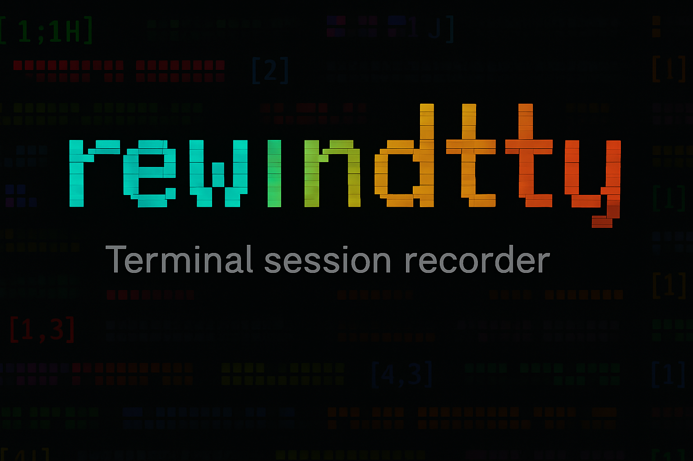
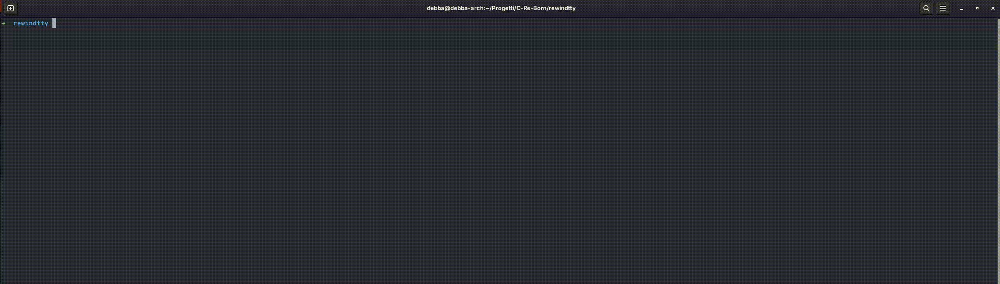

<p align="center">
  <picture>
    
  </picture>
</p>

A terminal session recorder and replayer written in C that allows you to capture and replay terminal sessions with precise timing.

<p align="center">
  <picture>
    
  </picture>
</p>

## ⚠️ Disclaimer

This is a hobby project created for fun and learning purposes. It's still in active development and may contain bugs or incomplete features. If you encounter any issues, please report them in the [Issues](https://github.com/debba/rewindtty/issues) section. Contributions are welcome and encouraged!

## Features

- **Record terminal sessions**: Capture all terminal input/output with accurate timing information
- **Replay sessions**: Play back recorded sessions with original timing
- **JSON format**: Sessions are stored in a structured JSON format for easy parsing
- **Signal handling**: Graceful shutdown and file closure on interruption
- **Lightweight**: Minimal dependencies, written in pure C
- **Web browser player**: Advanced browser-based player with interactive timeline and controls

## Building

### Prerequisites

- GCC compiler
- GNU Make
- Standard C library with GNU extensions
- Git (for cloning project and submodules)

### Cloning the repository

This project uses cJSON as a Git submodule.
Make sure to clone with submodules:

```bash
git clone --recurse-submodules https://github.com/debba/rewindtty.git
```

If you already cloned the repository without submodules, run:

```bash
git submodule update --init --recursive
```

### Compilation

```bash
make
```

This will create the executable at `build/rewindtty`.

To clean build artifacts:

```bash
make clean
```

## Usage

### Recording a Session

To start recording a terminal session:

```bash
./build/rewindtty record [file]
```

This will create a new session file (defaults to `data/session.json` if no file is specified) and begin capturing all terminal activity.

### Replaying a Session

To replay a previously recorded session:

```bash
./build/rewindtty replay [file]
```

This will read the session file (defaults to `data/session.json` if no file is specified) and replay it with the original timing.

### Command Line Options

```
Usage: rewindtty [record|replay] [file]

Commands:
  record [file]    Start recording a new terminal session to specified file (default: data/session.json)
  replay [file]    Replay a recorded session from specified file (default: data/session.json)
```

## Browser Player

The `browser_player` directory contains an advanced web-based player for rewindtty sessions that provides enhanced features and a modern interface.

### Features

- **Interactive timeline**: Visual timeline with scrubbing support for easy navigation
- **Command list**: Sidebar showing all executed commands with click-to-jump functionality
- **Bookmarks**: Add and manage bookmarks at specific moments in the session
- **Playback controls**: Play, pause, restart, and speed adjustment (1x, 2x, 4x, 8x)
- **File loading**: Drag-and-drop or file picker support for JSON session files
- **Real-time status**: Display current command and session timing information
- **Modern UI**: Clean, responsive interface built with TypeScript and Vite

### Usage

1. Navigate to the browser_player directory:

   ```bash
   cd browser_player
   ```

2. Install dependencies:

   ```bash
   npm install
   ```

3. Start the development server:

   ```bash
   npm run dev
   ```

4. Open your browser and load a JSON session file to start playing

### Building for Production

```bash
npm run build
```

The browser player uses xterm.js for terminal emulation and provides a significantly enhanced experience compared to the basic command-line replay functionality.

## File Structure

```
rewindtty/
├── src/
│   ├── main.c          # Main program entry point
│   ├── recorder.c      # Session recording functionality
│   ├── recorder.h      # Recording function declarations
│   ├── replayer.c      # Session replay functionality
│   ├── replayer.h      # Replay function declarations
│   ├── utils.c         # Utility functions
│   └── utils.h         # Utility function declarations
├── browser_player/     # Web-based advanced player
│   ├── src/
│   │   ├── main.ts     # Entry point
│   │   ├── player.ts   # Player implementation
│   │   ├── types.ts    # TypeScript type definitions
│   │   └── style.css   # Player styles
│   ├── index.html      # HTML template
│   ├── package.json    # Node.js dependencies
│   └── tsconfig.json   # TypeScript configuration
├── data/
│   └── session.json    # Default session storage file
├── build/              # Build output directory
├── assets/
│   └── demo.gif        # Demo animation
├── libs/
│   └── cjson/          # JSON parsing library
├── LICENSE             # MIT License
├── Makefile           # Build configuration
└── README.md          # This file
```

## Session File Format

Sessions are stored in JSON format in the `data/session.json` file. The format captures timing information and terminal data to enable accurate replay.

## Signal Handling

The recorder handles interruption signals (like Ctrl+C) gracefully by:

- Closing the session file properly
- Writing the final JSON structure
- Cleaning up resources before exit

## Development

### Compiler Flags

The project uses the following GCC flags:

- `-Wall -Wextra`: Enable comprehensive warnings
- `-std=gnu99`: Use GNU C99 standard
- `-g`: Include debugging symbols

### Contributing

1. Fork the repository
2. Create a feature branch
3. Make your changes
4. Test thoroughly
5. Submit a pull request

## License

This project is licensed under the MIT License - see the [LICENSE](LICENSE) file for details.

Copyright (c) 2025 Andrea Debernardi

## Technical Notes

- Uses standard POSIX system calls for terminal interaction
- Implements proper signal handling for clean shutdown
- JSON output format enables integration with other tools
- Minimal memory footprint and dependencies
